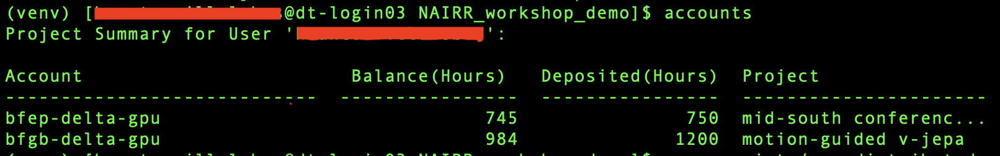

<p align="center">
  
</p>

<br/>

<p align="center">
  
  
  
  
  
</p>

<br/>

# Training Medical AI Models on HPC: A Hands-On Workshop

> **THRIVE Workshop** | NSF NAIRR & ACCESS — Delta HPC | University of Tennessee | Tennessee Tech University

A hands-on training module for AI practitioners covering everything from accessing national HPC resources to launching distributed deep learning training jobs on the [Delta](https://docs.ncsa.illinois.edu/systems/delta/en/latest/index.html) supercomputer at NCSA. By the end of this session you will have submitted a real distributed training job that trains a chest X-ray AI model across multiple GPUs.

---

## Table of Contents

1. [What You Will Learn](#-what-you-will-learn)
2. [Workshop Overview](#-workshop-overview)
3. [Background: HPC, NAIRR & ACCESS](#-background-hpc-nairr--access)
4. [Getting ACCESS *(Reference)*](#-getting-access-reference--skip-during-training)
5. [Connecting to Delta](#-connecting-to-delta)
6. [Navigating the Delta File System](#-navigating-the-delta-file-system)
7. [Setting Up Your Environment](#-setting-up-your-environment)
8. [Understanding the Training Pipeline](#-understanding-the-training-pipeline)
9. [Configuring & Submitting a Training Job](#-configuring--submitting-a-training-job)
10. [Monitoring Your Job](#-monitoring-your-job)
11. [Hands-On Exercises](#-hands-on-exercises)
12. [What You Have Learned](#-what-you-have-learned)
13. [Additional Resources](#-additional-resources)

---

## 🎯 What You Will Learn

By the end of this workshop you will be able to:

- **Explain** what High-Performance Computing (HPC) is and why it is essential for training modern AI models
- **Navigate** the Delta HPC file system and understand its storage tiers
- **Set up** a Python virtual environment and install dependencies on an HPC cluster
- **Read and configure** a SLURM batch script to request GPU resources
- **Submit, monitor, and cancel** jobs using SLURM
- **Scale** a training job across multiple GPUs and nodes using PyTorch Distributed Data Parallel (DDP)
- **Reason** about the trade-offs in batch size, GPU count, and node count when training at scale

---

## 📋 Workshop Overview

### The Task

We will train **ResNet-101**, a deep convolutional neural network, on the **CheXpert** dataset — a large collection of over 224,000 chest X-rays labeled for 14 clinically significant conditions. This is a real-world medical AI workload that would take days on a single laptop GPU but completes in minutes on Delta.

| Detail | Value |
|---|---|
| Model | ResNet-101 (adapted for grayscale X-ray input) |
| Dataset | CheXpert — 14-label chest X-ray classification |
| Training Framework | PyTorch + Distributed Data Parallel (DDP) |
| HPC System | Delta @ NCSA (UIUC) |
| Resource Allocation | NSF ACCESS |
| Node Type | `gpuA40x4` — 4× NVIDIA A40 GPUs per node |

### Prerequisites

- Basic familiarity with Python and the command line
- An ACCESS account *(pre-provisioned for this workshop — see [Getting ACCESS](#-getting-access-reference--skip-during-training) for general instructions)*
- An SSH client (Terminal on macOS/Linux; Windows Terminal or PuTTY on Windows)

---

## 🖥️ Background: HPC, NAIRR & ACCESS

### Why HPC for AI?

Training modern neural networks — especially those that process high-resolution medical images — requires vastly more compute than a typical laptop or workstation can provide. Consider:

- A single epoch of CheXpert training can take **50+ minutes** on a single GPU
- At 3 epochs and a batch size of 16, reaching meaningful accuracy requires **hours** of sustained compute
- State-of-the-art medical AI models are typically trained for dozens of epochs across hundreds of thousands of images

HPC systems solve this by providing **clusters of hundreds or thousands of GPUs** connected by ultra-high-speed networks. A job that would take a week on one GPU can complete in hours across a cluster.

```
Your Laptop          HPC Cluster (Delta)
┌──────────┐         ┌───────────────────────────────────────┐
│ 1 GPU    │   vs.   │ Node 1: 4× A40   |
| ~24 GB   |         | Node 2: 4× A40   │
│          │         │ Node 3: 4× A40...|
|          |         | Node N: 4× A40   │
│ 1 user   │         │ Hundreds of GPUs| 
|          |         |— shared resource │
└──────────┘         |                  | └───────────────────────────────────────┘
```

### What is NAIRR?

The **National AI Research Resource (NAIRR)** is a shared national research infrastructure funded by the NSF with the goal of democratizing access to the compute, data, and tools needed to advance AI research across the United States — particularly for researchers at institutions that would otherwise lack access to such resources.

### What is ACCESS?

**ACCESS** (Advanced Cyberinfrastructure Coordination Ecosystem: Services & Support) is the NSF program that manages allocations of compute time on national HPC systems, including Delta. Think of ACCESS credits as the currency you spend to reserve GPU hours on these systems.

> For a deeper dive into NAIRR and ACCESS, these topics are covered in a dedicated session. For now, all you need to know is that the allocation for today's workshop has already been provisioned for you.

### Delta HPC — Our System Today

[Delta](https://docs.ncsa.illinois.edu/systems/delta/en/latest/index.html) is a flagship HPC system operated by the **National Center for Supercomputing Applications (NCSA)** at the University of Illinois Urbana-Champaign. It is one of the most GPU-dense academic computing resources in the United States.

For today's workshop we will use `gpuA40x4` nodes — each equipped with **4 NVIDIA A40 GPUs** (48 GB VRAM each).

| Node Type | GPUs per Node | VRAM | Charge Factor |
|---|---|---|---|
| `gpuA40x4` | 4× NVIDIA A40 | 48 GB each | 0.5× |
| `gpuA100x4` | 4× NVIDIA A100 | 40 GB each | 1.0× |
| `gpuA100x8` | 8× NVIDIA A100 | 80 GB each | 1.5× |

> 1 GPU hour costs `66.67 × charge_factor` ACCESS credits. At 0.5×, a 4-GPU job running for 15 minutes costs `66.67 × 0.5 × 4 × 0.25 ≈ 33` credits.

<br/>

<p align="center">
  
  <br/>
  <em>Delta HPC System — NCSA, University of Illinois Urbana-Champaign. Source: <a href="https://learn.ncsa.illinois.edu/">learn.ncsa.illinois.edu</a></em>
</p>

---

## 🔐 Getting ACCESS *(Reference)*

> **Note for workshop attendees:** Your ACCESS account and allocation have already been set up. This section is provided as a reference for when you want to access HPC resources independently after the workshop.

### Step 1 — Create an ACCESS Account

1. Go to [access-ci.org](https://access-ci.org/) and click **Create Account**
2. Use your institutional email address (.edu preferred)
3. Verify your email and complete your profile
4. Note your **ACCESS username** — you will use this to log in to all ACCESS-affiliated HPC systems

### Step 2 — Request an Allocation

ACCESS offers several allocation types depending on the scale of your project:

| Allocation Type | Typical Use | Credits |
|---|---|---|
| **Explore** | Testing, learning, small experiments | Up to 400,000 |
| **Discover** | Early-stage research | Up to 1,500,000 |
| **Accelerate** | Active research projects | Up to 3,000,000 |
| **Maximize** | Large-scale production workloads | 3,000,000+ |

For new users, start with an **Explore** allocation — the review process is lightweight and turnaround is typically a few days.

1. Log in at [allocations.access-ci.org](https://allocations.access-ci.org/)
2. Click **Submit** → **Explore Access** (for new, smaller allocations)
3. Describe your research goals, required resources, and justification
4. Once approved, your allocation will appear on your ACCESS dashboard

### Step 3 — Link Your Allocation to Delta

Once you have an allocation, you can request access to Delta specifically through the ACCESS user portal. After approval, you will receive a **Delta username** and instructions to set up multi-factor authentication. Follow [these](https://go.ncsa.illinois.edu/2fa) instructions to setup Duo for DELTA NCSA access.

---

## 🔌 Connecting to Delta

Delta uses **SSH** (Secure Shell) for remote access. You will connect from your local terminal to Delta's login nodes.

### Log In via SSH

```bash
ssh [your_delta_username]@login.delta.ncsa.illinois.edu
```

Type your Kerberos password and press the Enter key. Then, you will use your **two-factor authentication (2FA)** code via Duo. After successful authentication you will land at a login node shell prompt:

```
[username@dt-loginXX ~]$
```

> **Important:** Login nodes are shared and are not meant for running compute-intensive jobs. Always use SLURM to submit jobs to compute nodes. Running heavy computation directly on a login node may result in your session being terminated.

### SSH Tips

```bash
# Save yourself typing by adding an alias to ~/.ssh/config on your LOCAL machine:
Host delta
    HostName login.delta.ncsa.illinois.edu
    User your_delta_username

# Then you can simply run:
ssh delta
```

---

## 📂 Navigating the Delta File System

Delta organizes storage into three tiers with different performance characteristics and intended uses:

```
/
├── projects/[ALLOCATION_ID]/[username]/   # Shared project files (venvs, code)
├── work/nvme/[ALLOCATION_ID]/[username]/  # Fast NVMe scratch (active training data)
└── work/hdd/[ALLOCATION_ID]/[username]/   # Large, slower HDD storage (datasets)
```

| Location | Speed | Best For |
|---|---|---|
| `/projects/` | Moderate | Shared code, virtual environments, config files |
| `/work/nvme/` | Very Fast (NVMe SSD) | Frequently accessed training data, checkpoints |
| `/work/hdd/` | Slower (HDD) | Large raw datasets (e.g., CheXpert ~439 GB) |

### Workshop Paths

| Resource | Path |
|---|---|
| CheXpert dataset | `/work/hdd/bfep/lewis1/` |
| Your home directory | `~` (`/u/[your_username]`) |

> **Note:** Storage on Delta is not permanent. Data in `/work/` is subject to purge policies. Always keep a copy of important data elsewhere.

---

## ⚙️ Setting Up Your Environment

### Step 1 — Load Python

Delta ships with Python 3.9 by default, which is too old for our dependencies. Load the latest available version using the module system:

```bash
module load python
python --version   # Should show Python 3.11.x
```

> The `module` system is how HPC clusters manage software versions. `module load python` makes a newer Python available in your session.

### Step 2 — Clone the Workshop Repository

```bash
# Navigate to your home directory
cd ~

# Clone the repository
git clone https://github.com/MARCI-UTK/NAIRR_workshop_demo.git

# Enter the project directory
cd NAIRR_workshop_demo
```

### Step 3 — Create a Virtual Environment

A virtual environment keeps your project's Python packages isolated from the system and from other users' projects.

```bash
# Create the virtual environment in your home directory
python -m venv ~/venv

# Activate it
source ~/venv/bin/activate

# Your prompt will change to show (venv):
# (venv) [username@dt-login01 NAIRR_workshop_demo]$
```

### Step 4 — Install Dependencies

```bash
# Upgrade pip first (good practice)
pip install --upgrade pip

# Install all required packages from the repo's requirements file
pip install -r requirements.txt
```

This installs: `torch`, `torchvision`, `timm`, `numpy`, `pandas`, `Pillow`, `PyYAML`, `tqdm`

> Installation may take 2–5 minutes. PyTorch alone is a large package. This only needs to be done once — your venv persists between sessions.

### Step 5 — Create Required Output Directories

The training script writes logs and TensorBoard output to local directories that must exist before the job starts:

```bash
mkdir -p logs runs
```

---

## 🧠 Understanding the Training Pipeline

### The Dataset: CheXpert

[CheXpert](https://stanfordmlgroup.github.io/competitions/chexpert/) is a large chest X-ray dataset created by Stanford ML Group. It contains **224,316 chest radiographs** from 65,240 patients, each labeled for 14 observations including:

`Cardiomegaly` · `Edema` · `Consolidation` · `Atelectasis` · `Pleural Effusion` · and 9 more

This makes it a **multi-label classification** problem — a single X-ray can simultaneously show multiple findings. It is a canonical benchmark for medical AI research.

### The Model: ResNet-101

We use **ResNet-101**, a 101-layer residual convolutional neural network, loaded via the `timm` library. Two modifications are made to fit the CheXpert task:

```python
# 1. Change input conv to accept greyscale (1 channel) instead of RGB (3 channels)
model.conv1 = torch.nn.Conv2d(1, 64, kernel_size=7, stride=2, padding=3, bias=False)

# 2. Change output layer to predict 14 disease labels instead of 1000 ImageNet classes
model.fc = torch.nn.Linear(model.fc.in_features, 14)
```

### Distributed Training with PyTorch DDP

When training across multiple GPUs, the workload is split using **Distributed Data Parallel (DDP)**:

```
                    ┌─────── Parameter Server / All-Reduce ───────┐
                    │                                             │
          ┌─────────▼──────────┐                   ┌─────────────▼──────────┐
          │       GPU 0        │                   │         GPU 3          │
          │  Mini-batch 0      │       ...         │    Mini-batch 3        │
          │  Forward pass      │                   │    Forward pass        │
          │  Backward pass     │                   │    Backward pass       │
          │  Gradients  ───────┼───────────────────┼──► Sync & Average      │
          └────────────────────┘                   └────────────────────────┘
```

Each GPU processes a different subset of the data simultaneously. After each step, gradients are averaged across all GPUs via **NCCL** (NVIDIA Collective Communications Library) so all GPUs stay in sync. This is managed automatically by PyTorch DDP — you do not need to write synchronization code yourself.

`torchrun` handles launching the correct number of processes, and SLURM ensures the hardware is reserved and available.

### The Configuration File

Training parameters are controlled via `config/distributed_config.yaml`:

```yaml
# timm model being used
model_name: 'resnet101.a1_in1k'

# Directory where Tensorboard output goes
log_dir: runs/resnet101/

# Data related parameters
data:
  root: '/work/hdd/bfep/lewis1'   # <-- Update this to your username
  batch_size: 16

# Optimization settings
optimization:
  num_epochs: 3
  learning_rate: 1e-4
```

### The SLURM Script

Jobs are submitted to Delta via a SLURM batch script (`scripts/run_distributed.sh`). Every line that begins with `#SBATCH` is a **resource request** that SLURM reads before the job starts:

```bash
#!/bin/bash
#SBATCH --account=[ALLOCATION_ACCT]   # Your ACCESS allocation ID
#SBATCH --partition=gpuA40x4          # Type of node: 4× NVIDIA A40
#SBATCH --job-name=chexpert_train     # Job name (visible in queue)
#SBATCH --nodes=1                     # Number of nodes
#SBATCH --ntasks-per-node=1           # 1 SLURM task per node (PyTorch manages subprocesses)
#SBATCH --gpus-per-node=4             # GPUs per node
#SBATCH --cpus-per-task=32            # CPUs per node (rule of thumb: num_workers × gpus)
#SBATCH --mem=64G                     # RAM per node
#SBATCH --time=0:15:00                # Wall-clock time limit (HH:MM:SS)
#SBATCH --output=logs/%j.out          # Stdout → logs/<job_id>.out
#SBATCH --error=logs/%j.err           # Stderr → logs/<job_id>.err

# Load latest Python module
module load python

# Activate virtual environment
source ~/venv/bin/activate

# Determine master node IP for distributed coordination
MASTER_ADDR=$(scontrol show hostnames "$SLURM_JOB_NODELIST" | head -n 1)
MASTER_PORT=25827   # <-- Each user should use a unique port number

# Launch distributed training
srun torchrun \
    --nproc_per_node=4 \          # Processes per node = GPUs per node
    --nnodes=$SLURM_NNODES \      # Total nodes (from SLURM)
    --node_rank=$SLURM_NODEID \   # This node's rank
    --master_addr=$MASTER_ADDR \
    --master_port=$MASTER_PORT \
    distributed_train.py --fname config/distributed_config.yaml
```

> **MASTER_PORT:** Each user submitting a job should use a **unique port number** to avoid conflicts (e.g., your student or employee ID's last 5 digits). Choose a number between 10000–65000.

---

## 🚀 Configuring & Submitting a Training Job

### Step 1 — Update the Config File

```bash
# Open the config file
nano config/distributed_config.yaml
```

Update the `data.root` field to point to your copy of the dataset:

```yaml
data:
  root: '/work/hdd/bfep/lewis1/chexpert'
  batch_size: 16
```

Save and exit (`Ctrl+O`, `Enter`, `Ctrl+X` in nano).

### Step 2 — Update the SLURM Script

Get the name of the allocated compute account.
```bash
accounts
```

<p align="center">
  
</p>

```bash
nano scripts/run_distributed.sh
```

Make these two changes:

1. Set your allocation account:
   ```bash
   #SBATCH --account=bfep-delta-gpu   # The workshop allocation
   ```

2. Set a unique `MASTER_PORT` (use any 5-digit number unique to you):
   ```bash
   MASTER_PORT=XXXXX
   ```

### Step 3 — Submit the Job

```bash
sbatch scripts/run_distributed.sh
```

If successful, SLURM will respond with your job ID:

```
Submitted batch job 1234567
```

---

## 📊 Monitoring Your Job

### Check Job Status

```bash
squeue -u $USER
```

Output example:

```
JOBID      PARTITION     NAME          USER    ST    TIME   NODES NODELIST
1234567    gpuA40x4      chexpert_tra  jdoe    PD    0:00    1    (Priority)
```

**Status codes:**

| Code | Meaning |
|---|---|
| `PD` | Pending — waiting in queue |
| `R` | Running |
| `CG` | Completing — wrapping up |
| `F` | Failed |
| `CD` | Completed successfully |

### View Live Output

```bash
# Stream the output log as it updates
tail -f logs/[job_id].out

# Stream error log
tail -f logs/[job_id].err
```

### Cancel a Job

```bash
# Get the job ID from squeue, then:
scancel [job_id]
```

### Detailed Job Information

```bash
# See full details of a job (running or recently completed)
scontrol show job [job_id]

# See resource usage after completion
sacct -j [job_id] --format=JobID,Elapsed,CPUTime,MaxRSS,State
```

---

## 🏋️ Hands-On Exercises

Work through these exercises in order. Each builds on the previous one. After each change, submit the job and record your observations in the output log.

---

### Exercise 1: Adjust Batch Size

**Goal:** Understand the effect of batch size on training speed and GPU memory usage.

**Background:** Batch size controls how many images are processed together in a single training step. Larger batches make better use of GPU parallelism but consume more memory.

**Instructions:**

1. Open `config/distributed_config.yaml`
2. Change `batch_size` from `16` to `64`
3. Submit the job (`sbatch scripts/run_distributed.sh`)
4. Monitor the output log

**Questions to consider:**
- Did the training step time change? Did it get faster or slower?
- Did you encounter any CUDA out-of-memory errors? If so, what does that tell you about GPU memory limits?
- What is the trade-off between a smaller vs. larger batch size?

> **Tip:** If you hit OOM (out of memory) errors, try `32` before going to `64`.

---

### Exercise 2: Scale to More GPUs

**Goal:** Observe the effect of changing the number of GPUs used for training.

**Background:** Adding more GPUs allows more data to be processed in parallel. Ideally, doubling GPUs should halve training time — but communication overhead means real-world speedups are sub-linear.

**Instructions:**

1. Open `scripts/run_distributed.sh`
2. Change `--gpus-per-node` from `4` to `2`:
   ```bash
   #SBATCH --gpus-per-node=2
   ```
3. Also update `--cpus-per-task` proportionally (e.g., `16` for 2 GPUs)
4. Update `--nproc_per_node` in the `torchrun` command to match:
   ```bash
   --nproc_per_node=2 \
   ```
5. Submit and observe

**Questions to consider:**
- How did training time per step change compared to 4 GPUs?
- Was the speedup exactly 2×? Why or why not?
- What SLURM parameters control GPU allocation?

---

### Exercise 3: Scale Across Multiple Nodes

**Goal:** Run training across 2 nodes (8 GPUs total) and observe multi-node distributed training.

**Background:** When a single node's GPUs are not enough (either in number or memory), jobs can span multiple nodes. NCCL handles the inter-node communication over Delta's high-speed InfiniBand network.

**Instructions:**

1. Open `scripts/run_distributed.sh`
2. Change `--nodes` to `2`:
   ```bash
   #SBATCH --nodes=2
   ```
3. Keep `--gpus-per-node=4` (so you will use 8 GPUs total across 2 nodes)
4. Keep `--nproc_per_node=4` in `torchrun` (4 processes per node)
5. Submit and observe

**Questions to consider:**
- How does the total number of GPUs in the job compare to Exercises 1 and 2?
- Notice how the `MASTER_ADDR` is dynamically resolved from `$SLURM_JOB_NODELIST` — why is this important when using multiple nodes?
- What would happen if two users used the same `MASTER_PORT` on overlapping jobs?

---

### Visualizing Training using Tensorboard 

---

## ✅ What You Have Learned

Congratulations — you have run a real distributed AI training job on a national supercomputer. Here is a summary of the key concepts from today's session:

| Concept | Key Takeaway |
|---|---|
| **HPC for AI** | National HPC systems like Delta provide GPU resources orders of magnitude beyond what a workstation can offer — making large-scale medical AI research feasible |
| **SLURM** | The standard job scheduler for HPC. You describe your resource needs in a batch script and SLURM allocates them when available |
| **Distributed Training** | PyTorch DDP splits data across GPUs; gradients are synchronized via NCCL after each step — all coordinated by `torchrun` |
| **`#SBATCH` directives** | Resource requests embedded in the shell script — nodes, GPUs, memory, time, and output paths |
| **Virtual Environments** | Standard Python isolation on HPC; always `module load python` before creating or activating a venv on Delta |
| **Batch Size Trade-offs** | Larger batches → faster wall-clock time per epoch (up to GPU memory limit); smaller batches → more gradient updates per epoch |
| **Scaling Laws** | Adding GPUs speeds up training but with diminishing returns due to synchronization overhead |

---

## 📚 Additional Resources

### NSF NAIRR & ACCESS
| Resource | Link |
|---|---|
| NSF NAIRR Pilot | [nairrpilot.org](https://nairrpilot.org/) |
| ACCESS Program | [access-ci.org](https://access-ci.org/) |
| REQUEST an Allocation | [allocations.access-ci.org](https://allocations.access-ci.org/) |

### Delta HPC Documentation
| Resource | Link |
|---|---|
| Delta User Guide | [docs.ncsa.illinois.edu/systems/delta](https://docs.ncsa.illinois.edu/systems/delta/en/latest/index.html) |
| Running Jobs on Delta | [Job Management Guide](https://docs.ncsa.illinois.edu/systems/delta/en/latest/user_guide/running_jobs.html) |
| Delta Storage Guide | [Data Management](https://docs.ncsa.illinois.edu/systems/delta/en/latest/user_guide/data_mgmt.html) |
| NCSA Learning Resources | [learn.ncsa.illinois.edu](https://learn.ncsa.illinois.edu/) |

### Deep Learning & Distributed Training
| Resource | Link |
|---|---|
| PyTorch DDP Tutorial | [pytorch.org/tutorials/distributed](https://pytorch.org/tutorials/intermediate/ddp_tutorial.html) |
| `torchrun` Documentation | [pytorch.org/docs/stable/elastic](https://pytorch.org/docs/stable/elastic/run.html) |
| SLURM Documentation | [slurm.schedmd.com](https://slurm.schedmd.com/documentation.html) |
| `timm` Model Library | [huggingface.co/docs/timm](https://huggingface.co/docs/timm) |

### The CheXpert Dataset & Paper
| Resource | Link |
|---|---|
| CheXpert Dataset | [stanfordmlgroup.github.io/competitions/chexpert](https://stanfordmlgroup.github.io/competitions/chexpert/) |
| CheXpert Paper (Irvin et al., 2019) | [arxiv.org/abs/1901.07031](https://arxiv.org/abs/1901.07031) |

### Recommended Reading
- **"Dive into Deep Learning"** — free interactive textbook: [d2l.ai](https://d2l.ai/)
- **"An Introduction to High-Performance Scientific Computing"** — [hpc-wiki.info](https://hpc-wiki.info/)
- **PyTorch Recipes** — short, focused examples: [pytorch.org/tutorials/recipes](https://pytorch.org/tutorials/recipes/recipes_index.html)

---

<br/>

<p align="center">
  <strong>THRIVE</strong> — Tennessee Health Research and Innovation using Verified AI Ecosystems<br/>
  Supported by the NSF National AI Research Resource (NAIRR) Pilot and the ACCESS program.<br/><br/>
  <em>Questions? Open an issue in this repository or reach out to your workshop instructor.</em>
</p>
